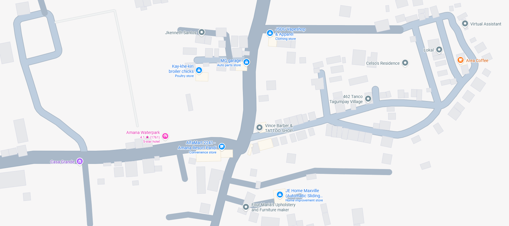

<p align="center">
  
</p>

# PathFinder-BFS

A simple web-based pathfinding visualizer that demonstrates how the Breadth-First Search (BFS) algorithm finds the shortest path between two locations on a map.

---

## Preview

<p align="center">
  
</p>

---

## Features

- Interactive map
- Shortest path visualization
- Breadth-First Search (BFS) algorithm
- Fast and simple interface
- Responsive design

---

## Built With

- HTML5
- CSS3
- JavaScript

---

## Project Structure

```
PathFinder-BFS/
│
├── index.html
├── css/
├── js/
├── assets/
├── images/
└── README.md
```

---

## Getting Started

### Clone the repository

```bash
git clone https://github.com/juliancagadas/PathFinder-BFS.git
```

### Open the project

Open `index.html` in your preferred web browser.

---

## How It Works

1. Select a starting location.
2. Select a destination.
3. The application applies the Breadth-First Search (BFS) algorithm.
4. The shortest available route is displayed on the map.

---

## About Breadth-First Search

Breadth-First Search (BFS) is a graph traversal algorithm that explores neighboring nodes level by level. It guarantees the shortest path in an unweighted graph.

---

## Algorithm Flow

```text
Start
  │
Visit Start Node
  │
Add Neighbors to Queue
  │
Visit Next Node
  │
Destination Found?
├── No  → Continue
└── Yes → Display Shortest Path
```

---

## Author

**Julian Nathaniel Cagadas**

---

## License

This project is for educational purposes.
